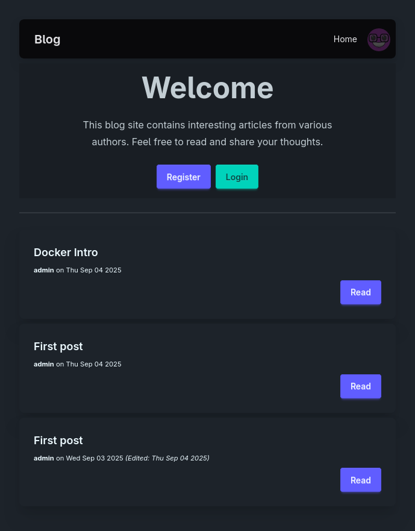
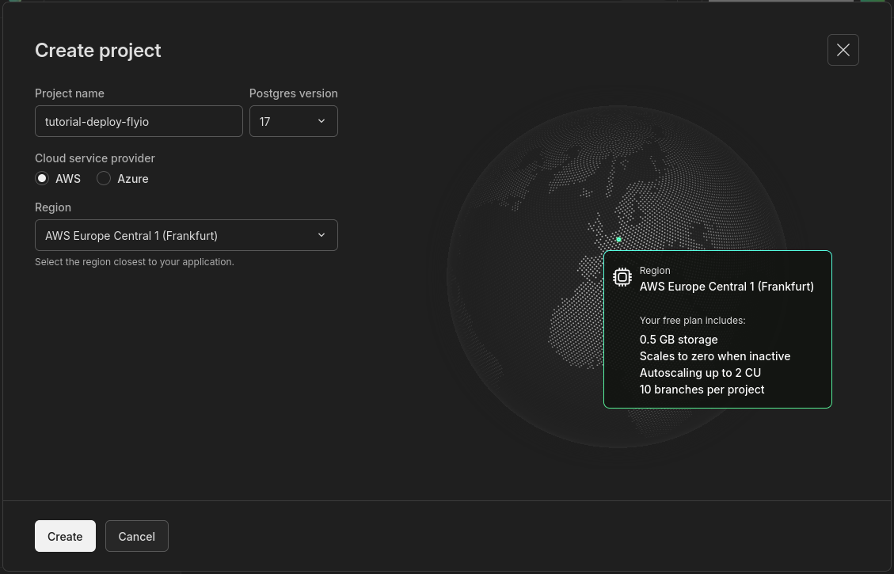
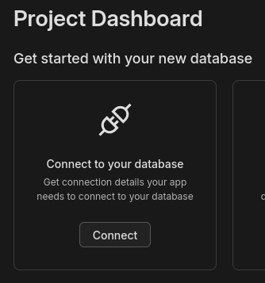
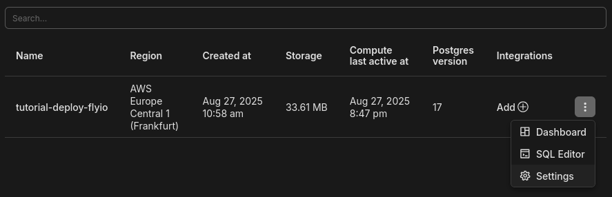

# Deploy React and ASP.NET to Fly.io

<!--toc:start-->
- [Deploy React and ASP.NET to Fly.io](#deploy-react-and-aspnet-to-flyio)
  - [Introduction](#introduction)
  - [Dockerize](#dockerize)
    - [Server](#server)
    - [Client](#client)
    - [Docker compose](#docker-compose)
  - [Hosted Postgres](#hosted-postgres)
  - [Fly.io](#flyio)
    - [Deploy Backend](#deploy-backend)
    - [Deploy Client](#deploy-client)
  - [Cleanup](#cleanup)
<!--toc:end-->

## Introduction

In this tutorial you will learn how to deploy a full-stack application to
fly.io.
Here is a screenshot of what the app looks like.



We start by dockerizing the app.
That means writing a Dockerfile for both client and server.
Then we will write a docker compose file to start up all containers locally.
Last, we will deploy to Fly.io.

New to Fly.io?
Watch their video [Fly.io in 60 seconds](https://www.youtube.com/shorts/9Ou0CmP3uMA).

## Dockerize

To dockerize the app we need to create a Dockerfile for the back-end in
`server/` folder and for front-end in `client/` folder.

### Server

Create a new file named `Dockerfile` in `server/` folder.
The folder has couple of subfolders.
One for each C# project that are part of the solution.

We are using a multistage Dockerfile, so the final image only contains what's
needed to run the server.
The `dotnet/sdk` base images is required to run `dotnet publish`, but we only
use the smaller `dotnet/aspnet` image to run the compiled application.

Paths specified in a Dockerfile will be relative to its location.
So when we copy files into the container image, we use a `COPY . /source` to
copy everything from `server/` folder on host into `/source` within the build
container.

```Dockerfile
# 1. Create a stage for building the application.
FROM mcr.microsoft.com/dotnet/sdk:9.0-alpine AS build
# 2. Copy everything in current directory (server/) into /source on build container
COPY . /source
# 3. Change container working directory to /source/api
WORKDIR /source/Api
# 4. Build the application with Release configuration and for linux-x64 since Fly
# runs.
RUN dotnet publish --configuration Release --no-self-contained -o /app

# 5. Create a new stage for running the application with minimal runtime
# dependencies.
FROM mcr.microsoft.com/dotnet/aspnet:9.0-alpine AS final
# 6. Change container working directory to /app
WORKDIR /app
# 7. Copy everything needed to run the app from the "build" stage.
COPY --from=build /app .
# 8. Switch to a non-privileged user (defined in the base image) that the app will run under.
USER $APP_UID
# 9. Describe what port the server will listen on.
EXPOSE 8080
# 10. Start Api
CMD ["dotnet", "Api.dll"]
```

Here is a breakdown of the instructions.

**Build stage**

1. Use `dotnet/sdk` as base image.
2. Copy source code for server from host to `/source` folder inside the build container.
3. Change working directory inside the build container to `/source/Api`.
    - This is where `Program.cs` and `Api.csproj` files exist
4. Compile (publish) the application with release configuration.
    - The output is stored in `/app`

**Final stage**

5. Create a new stage named `final` with `dotnet/aspnet` as base image.
6. Change working directory for `final` stage to `/app`
7. Copy the compiled files `/app` in build stage to current directory (`/app`)
   in `final` stage.
8. Change user, so the app won't run as root with `USER $APP_UID`.
9. Tell Docker that it will expose `8080` network port.
10. Run the app with `dotnet Api.dll`

You can try it out by running:

```bash
docker build server
```

Note that `server` refer to the directory containing the Dockerfile to
build.

### Client

Moving over to the client.

This project is setup such that `client` use relative paths for all API calls.
It means that API requests will hit the HTTP server serving the front-end then
it will forward the request to the back-end HTTP server.
When running `npm run dev` it starts development web-server supporting
hot-reloading.
You can see the configuration for forwarding in `client/vite.config.ts`.
All great for development, but `npm run dev` should not be used in production.
For production, we will use nginx instead.
To make everything work, we need a custom config.
Create the file `client/nginx.conf.template` with:

```nginx
map $http_connection $connection_upgrade {
  "~*Upgrade" $http_connection;
  default keep-alive;
}

server {
  listen        80;

  root /usr/share/nginx/html;
  index index.html index.htm;

  location /api {
      proxy_pass         $BACKEND_URL;
      proxy_http_version 1.1;
      proxy_set_header   Upgrade $http_upgrade;
      proxy_set_header   Connection $connection_upgrade;
      proxy_set_header   Host $host;
      proxy_cache_bypass $http_upgrade;
      proxy_set_header   X-Forwarded-For $proxy_add_x_forwarded_for;
      proxy_set_header   X-Forwarded-Proto $scheme;
      proxy_ssl_server_name on;
  }
  location / {
      try_files $uri $uri/ /index.html index.html;
  }
}
```

The `client` (React) app use relative URLs for all request to `server`.
We therefore have a `location /api` block which proxy all request for `/api` to
the URL described in `proxy_pass`.
We use `$BACKEND_URL` as a placeholder that will be substituted with an
environment variable.
This allows us to control what URL request will be proxied from an environment
variable on the container.

Create a new file in `client/` folder named `Dockerfile`.
Insert the following:

```Dockerfile
# 1. Create a stage for building the application.
FROM node:22-alpine AS build
WORKDIR /app
# 2. Copy package.json and package-lock.json
COPY package*.json ./
# 3. Install dependencies
RUN npm clean-install
# Copy the rest of the application source code
COPY . .
# 4. Build the React application
RUN npm run build

# 5. Stage 2: Serve the React app using nginx
FROM nginx:alpine AS final
# 6. Custom nginx config
COPY nginx.conf.template /
# 7. Copy the build output from the first stage to nginx's html directory
COPY --from=build /app/dist /usr/share/nginx/html
# 8. Expose port 80
EXPOSE 80
# 9. Start nginx
CMD envsubst '$BACKEND_URL' < /nginx.conf.template > /etc/nginx/conf.d/default.conf \
  && nginx -g 'daemon off;'
```

We need a base image with `node` to transpile the code.
But we don't need node for serving the JavaScript files, however we do need
`nginx` instead.
Perfect candidate for a two stage build!

Here is a quick breakdown of the steps.

**Build stage**

1. Use `node:22-alpine` as base image
2. Copy `package.json` and `package-lock.json` (notice the `*`) into build
   container.
3. Install dependencies with `npm clean-install.
4. Transpile TypeScript to JavaScript with `npm run build`

**Final stage**

5. Use `nginx:alpine` as base image.
6. Copy our custom nginx config from host.
7. Copy build output from build stage to default folder for nginx.
8. Expose port 80 because that is the default port for nginx and HTTP.
9. Replace `BACKEND_URL` in nginx config and start nginx

The part `envsubst '$BACKEND_URL' < /nginx.conf.template > /etc/nginx/conf.d/default.conf` needs a bit of extra explanation.
The command `envsubst` is short for environment variable substitution.
It will substitute placeholders in its input for environment variables in its
output.
`/nginx.conf.template` is input and `/etc/nginx/conf.d/default.conf`
Thereby writing a configuration file for nginx when container is run that
includes a proxy URL given by an environment variable to the container.

Try it out by running:

```bash
docker build client
```

### Docker compose

We can combine it all with a Docker Compose file.
Not terribly useful for deploying to Fly.io, but pretty neat for onboarding new
teammates and getting them up and running.
All they need to start the app is clone the repository and type `docker compose up`.

There is already a `compose.yml` file in the root of the repository, but
currently it only contains a definition for the database.
Let's add `client` and `server` to it.
Change the `compose.yml` file in the root of the repository to this:

```yml
services:
  client:
    build: client/
    ports:
      - "80:80"
    environment:
      - BACKEND_URL=http://server:8080
  server:
    build: server/
    environment:
      - ConnectionStrings__AppDb=HOST=db;DB=postgres;UID=postgres;PWD=mysecret;PORT=5432;
    ports:
      - "8080:8080"
  db:
    image: postgres:17-alpine
    restart: always
    environment:
      POSTGRES_USER: postgres
      POSTGRES_PASSWORD: mysecret
    ports:
      - "5432:5432"
```

> [!WARNING]
> Never put connection string for your cloud hosted database into compose.yml
> like this.

It defines 3 services (client, server and db) which can be manged together as a
single unit.

For the **client** container, we use `BACKEND_URL` to tell how it can talk to
the **server** container.
And for the **server** service we set `ConnectionStrings__AppDb` to tell it how
it can talk to the **db** container.

Try it out by running:

```bash
docker compose up -d
```

We hope to see 3 containers when running:

```bash
docker compose ps
```

Wait!
There is only 2.
What happened to the server?
Time for some debugging!

You can view the logs with:

```bash
docker compose logs
```

The lines a prefix with name given to the container.
Looks like there is a stack-trace in the output for `server`.
This indicates that an exception was thrown.

We can "zoom-in" on the log output only for `server` by typing:

```bash
docker compose logs server
```

Somewhere towards the top, we see:

```
 Npgsql.NpgsqlException (0x80004005): Failed to connect to 172.18.0.4:5432
```

[Npgsql](https://www.nuget.org/packages/Npgsql) is the database driver we use
in .NET to talk to PostgreSQL and `5432` is the default port for PostgreSQL.
It means that it couldn't connect to the database.
Interesting, since we can see the `db` container is running but not `server`.

> [!TIP]
> The IP address `172.18.0.4` is internal to the virtual network Docker creates
> for containers.
> It is not accessible from the outside.

What's happening here is that all containers start in parallel.
The server starts a bit faster than the database, so it tries to connect before
the database is ready, which it can't, so it crashes.

It is possible to add dependencies between containers in a compose file, such
that a container is started after the container it depends on.

Add the following to the `server` service section in `compose.yml`:

```yml
    depends_on:
      db:
        condition: service_healthy
```

Here is a truncated version of what it should look like:

```yml
services:
  ...
  server:
    build: server/
    depends_on:
      db:
        condition: service_healthy
    ...
```

It means that `server` won't be started before `db` is in a healthy condition.
But what does being healthy mean for a database?
Luckily, they included `pg_isready` shell command to answer such deep
philosophical question.
I'm joking here.
Being healthy for a database simply means that it is ready to accept incoming
connections and there is a tool to test this in the `postgres` image.

Under the `db` section in `compose.yml`, add:

```yml
    healthcheck:
      test: ["CMD-SHELL", "pg_isready -U postgres"]
      interval: 1s
      timeout: 5s
      retries: 5
```

It simply checks the healthy by executing the shell command `pg_isready -U
postgres` where the `-U` is the username for database the instance.

Since `client` depends on `server`, we should also add this dependency to `compose.yml`.
So, under the `client` service section, add:

```yml
    depends_on:
      - server
```

Now if you do:

```bash
docker compose restart
docker compose ps
```

Then you should see all 3 containers running.
You can try it out by opening <http://localhost>

Here is the full `compose.yml` for reference, in case something is still wrong.

```yml
services:
  client:
    build: client/
    ports:
      - "80:80"
    depends_on:
      - server
  server:
    build: server/
    depends_on:
      db:
        condition: service_healthy
    environment:
      - ConnectionStrings__AppDb=HOST=db;DB=postgres;UID=postgres;PWD=mysecret;PORT=5432;
    ports:
      - "8080:8080"
  db:
    image: postgres:17-alpine
    restart: always
    environment:
      POSTGRES_USER: postgres
      POSTGRES_PASSWORD: mysecret
    ports:
      - "5432:5432"
    healthcheck:
      test: ["CMD-SHELL", "pg_isready -U postgres"]
      interval: 1s
      timeout: 5s
      retries: 5
```

## Hosted Postgres

The app requires a Postgres database to run.
It's fine to run a database locally through docker for development, but that
won't work when deploying the app.

Here are the options I can think of.
Pros and cons are given based on my opinion for small scale production ready
hosting.

- Deploy the [postgres docker image](https://hub.docker.com/_/postgres)
  - Pros: closely matching our development setup.
  - Cons: Complicated to manage security and backup
- [Fly managed Postgres](https://fly.io/docs/mpg/)
  - Pros: Same provider we use for hosting the app
  - Cons: Pricey
- [NEON serverless Postgres](https://neon.com/)
  - Pros: Easy, try for free
  - Cons: Runs on different data-centers than Fly.io

I think NEON has the best trade-off for this deployment exercise.

Go to <https://neon.com/> and sign-up for a free account.
Then create a new project in Neon.



For region, you want to choose something close to you.
Frankfurt seems to be the closest to where I'm located, so that is what I
choose.

After the project has been created, click on "Connect" as shown.



Change "psql" in the dropdown ".NET".
Then click "Copy snippet" and store it somewhere safe.
You will need it for later.

## Fly.io

The whole compose thing was a bit of a side-quest.
Now, back to the main quest-line.
Getting our app deployed to fly.io.

### Deploy Backend

Using Fly.io we can deploy from a docker image.
Normally the process would be:

1. Create a container registry
2. Build Dockerfile to image
3. Upload image to registry
4. Create a new Fly app (like a project on Fly.io)
5. Deploy image from registry to the app

That is how you deploy container images on most competitors.
However, fly.io conveniently wraps it all up in a single `fly launch` command.
Let's try it out!

```bash
cd server
fly launch --vm-size=shared-cpu-1x
fly scale count 1
```

_Hit "enter" to all questions._

Here's a breakdown.

1. Change directory to where the Dockerfile we want to deploy is located.
2. Launch using the smallest VM size possible.
3. Scale the number of instances to 1.

When launching an app, it creates 2 VMs which is great for availability.
Of one crashes then all traffic goes to the other while the first restarts.
However, we are just playing around deployment, so we don't care about
availability, instead we try to keep the cost as low as possible by scaling it
down to a single instance.

We can check the status of the deployment with:

```bash
fly status
```

Oh no, looks like it has crashed.
Let's check the logs to see what is going on.

```bash
fly logs
```

At the top of the stack-trace see `Host can't be null` and something about
Npgsql.
It's because we haven't configured the connection-string yet.

The connection-string contains password for the database instance, so it should
be treated as a secret.

We can use the `fly secrets set` command to set a secret.
Secrets are made available to the app as environment variables.
You can read [Secrets and Fly Apps](https://www.fly.io/docs/apps/secrets/) to
learn more.

In .NET we can use environment variables to override configurations in
`appsettings.json`.
Read [Tools and Best Practices for Secret Management in
.NET](https://code-maze.com/aspnetcore-secret-management/) to learn more.

From a terminal in `server/` folder, use `fly secrets set
ConnectionStrings__AppDb='<connection-string>` to set the connection-string,
where `<connection-string>` is replaced with the snippet you
copied from Neon.
It should look something like this:

```bash
fly secrets set ConnectionStrings__AppDb='Host=******************************.eu-central-1.aws.neon.tech; Database=neondb; Username=neondb_owner; Password=****************; SSL Mode=VerifyFull; Channel Binding=Require;'
```

> [!IMPORTANT]
> Notice that single-quotes `'` is used instead of double-quotes `"`

The app should redeploy after setting the secret.
You can check logs again to make sure it works.

```bash
fly logs
```

One last adjustment for the server, is to open `server/fly.toml` and change
`force_https` to `false` .

### Deploy Client

We can now deploy the `client` similar to what we did with the `server`.

```bash
cd client
fly launch --vm-size=shared-cpu-1x
fly scale count 1
```

_Hit "enter" to all questions._

You can open the page in a web-browser by typing:

```bash
fly open
```

We haven't set the `BACKEND` environment variable yet, so you get an error.

To fix it, set the variable in `client/fly.toml` by appending this:

```toml
[env]
  BACKEND_URL = "https://<backend-name>.fly.dev"
```

Replace `<backend-name>` with name of the server app, which you can find by
running:

```bash
fly apps list
```

Then redeploy with:

```bash
cd client
fly deploy
```

Try it out in your web-browser.
An easy way to open the URL is to type:

```bash
fly open
```

## Cleanup

To avoid potential being billing we better clean up again after ourselves by
removing the fly apps again.

To show the fly apps you have run:

```bash
fly apps list
```

Destroy the apps you created as part of this guide.

```bash
fly apps destroy <your-client-app-name>
fly apps destroy <your-server-app-name>
```

Where `<your-client-app-name>` and `<your-server-app-name>` are names from `fly
apps list`.

Go to <https://console.neon.tech/> then setting for "tutorial-deploy-flyio" project.



All the way down at the bottom of the page, click "Delete project" button.
